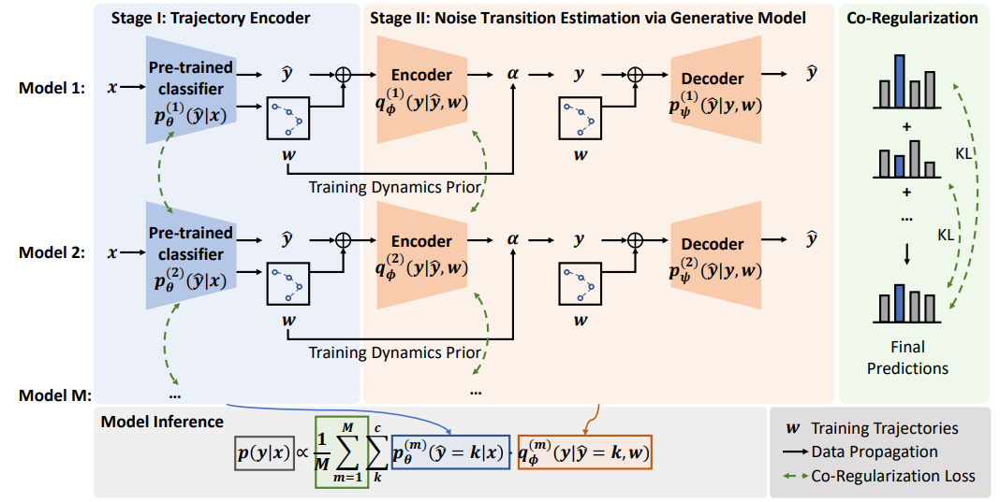

# Dynamics-Enhanced Generative Model (DyGen)

Official PyTorch implementation of our KDD 2023 paper "DyGen: Learning with Noisy Labels by Dynamics-Enhanced Generative Modeling". 

## Overview

Our method, DyGen, dynamic patterns in the embedding space during the fine-tuning process of language models to improve noisy label predictions. DyGen uses the variational auto-encoding framework to infer the posterior distributions of true labels from noisy labels and training dynamics. Additionally, a co-regularization mechanism is used to minimize the impact of potentially noisy labels and priors.

<p align="center">
  
</p>

## Setup

See `requirements.txt`. Packages with versions specified in `requirements.txt` are used to test the code. Other versions are not fully tested but may also work.  We also kindly suggest the users to run this code with Python version: `python>=3.8`.

## Data

Please download the save the raw datasets under the directory `./datasets/`. For example, if 20newsgroup dataset is used, please download and store the official raw data in the directory `./datasets/20news/`.

## Model Training

In the `./scripts/` directory, you can find several shell script files. If you want to train the model and use the gold labels to evaluate the new calibrated labels created by DyGen, please run the script `./scripts/train.sh`.

To train the model with gold labels, you can run the following commands:
```bash
sh ./scripts/train.sh
```

You can also test the model with your preferred arguments by changing the script files. The model parameters are defined in the `./main.py` file. We also offer explanation for each arguments in the code.

## Folder Structure
```bash
├── cache
│   ├── 20news-results.logs
│   └── dygen_acc_0.2_20.npy
├── data
│   └── 20news-bydate_py3.pkz
├── datasets
│   ├── 20news
│   │  ├── 20news-bydate_py3.pkz
│   │  ├── saved_data
│   │  │   ├── <Pre-Processed Data Files>
│   ├──... (other datasets)  
── figure
│   └── overview.png
├── main.py
├── model_save
│   └── <Saved Models>
├── readme.md
├── requirements.txt
├── scripts
│   └── train.sh
└── src
    ├── dynamics
    │   ├── euclidean_dist.py
    ├── model
    │   ├── evaluate.py
    │   ├── generate_prior.py
    │   ├── network.py
    │   ├── train_stage1.py
    │   └── train_stage2.py
    └── utils
        ├── generate_noise.py
        ├── utils2.py
        └── utils.py
```
